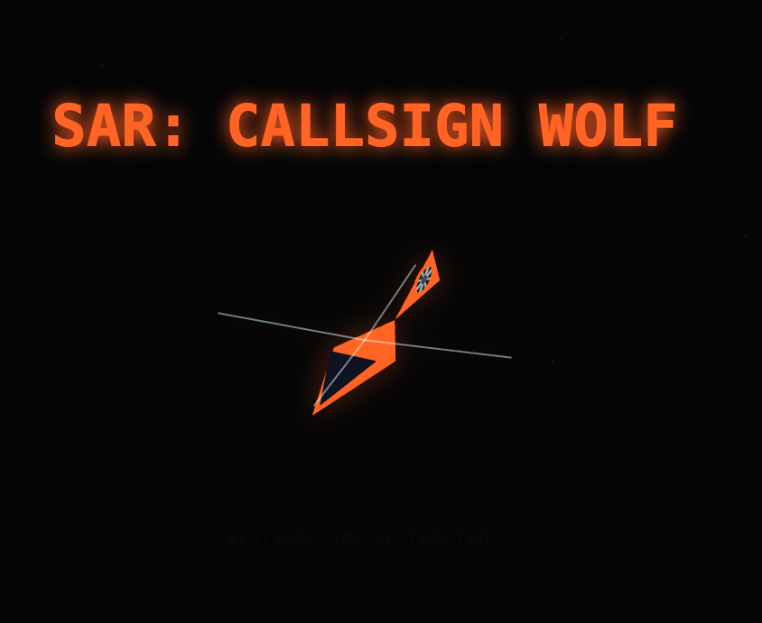

# SAR: Callsign WOLF



An isometric helicopter search-and-rescue simulator built with TypeScript and HTML5 Canvas. Inspired by Zeewolf (Binary Asylum, 1994).

Physics-based flight, winch operations, dynamic weather, procedural terrain, cargo transport — playable in any modern browser, no install required.

---

## Play

**Online:** [ithie.github.io/callsign-wolf](https://ithie.github.io/callsign-wolf)

**Local:** open `index.html` directly in any modern browser — no build step or server needed.

---

## Controls

| Key        | Action                                      |
| ---------- | ------------------------------------------- |
| W          | Start engine / Increase collective (ascend) |
| S          | Decrease collective (descend) / Stop engine |
| Arrow Keys | Pitch & Roll                                |
| A / D      | Yaw (turn left / right)                     |
| Q / E      | Winch up / down                             |

---

## Features

- **Isometric renderer** with painter's-algorithm depth sorting, backface culling, and declarative geometry (DEF system)
- **Physics-based flight** — inertia, tilt, wind drift, ground effect
- **Three helicopters** with distinct handling profiles:
    - _Dolphin_ — agile, lightweight, no cargo
    - _Coast-Hawk_ — heavy-lift workhorse, cargo-capable
    - _Atlas_ — tandem rotor, maximum capacity
- **Winch & rescue** — lower a rescuer, pick up survivors, haul them to safety
- **Cargo transport** — sling loads with pendulum physics
- **Fuel management** — refuel at fuel trucks on carrier or pad
- **Dynamic weather** — wind affects flight and rope physics
- **Campaigns** with multiple missions, briefings, and a commander portrait
- **ZSynth soundtrack** — original in-game music composed in the built-in tracker

---

## Campaigns

Select a campaign from the main menu, then choose your airframe. Each campaign has its own mission sequence, terrain, and objectives.

---

## Development

### Prerequisites

```sh
npm install
```

### Dev server

```sh
npm run dev
```

Starts the Vite dev server at `http://localhost:5173`.

### Build (Promo page)

```sh
npm run build
```

Produces a self-contained `dist/index.html` of the promo page with all JS and CSS inlined. Deployed to GitHub Pages on every push to `main`.

### App Build (iOS App Store)

```sh
npm run build:ios
```

Builds the game with `VITE_TARGET=app` and syncs the result into the Xcode project via `cap sync ios`. A `Content-Security-Policy` header (`default-src 'self' 'unsafe-inline' data:; media-src *;`) is injected into `index.html` automatically. See [INSTALL.md](./INSTALL.md) for the full Xcode workflow.

### Tests

```sh
npm test
```

Unit tests live next to their source files as `*.spec.ts`. Integration tests are in `src/tests/`.

### Deploy to GitHub Pages

Deployment runs automatically via GitHub Actions on every push to `main`. Manual deploy:

```sh
npm run deploy
```

---

## VS Code Extension

Install the extension for custom editors and live UI preview:

```sh
cd vscode-ext && npm run deploy
```

Reload VS Code after installation. The extension provides custom editors for `.zcampaign`, `.zsong`, `.zdef`, and `.zsound` files, plus a per-component UI preview for any `*.ui.ts` file.

See [docs/WORKBENCH.md](./docs/WORKBENCH.md) for full documentation.

---

## Project Structure

```text
src/
  game/
    campaigns/     Mission files (.zcampaign)
    models/        Isometric geometry definitions (.zdef)
    music/         Song files (.zsong)
    ui/            UI components (one directory per screen/overlay)
      <name>/
        <name>.ui.ts      Component (mount / show / hide)
        <name>.state.ts   Isolated state (where needed)
        <name>.css
        <name>.spec.ts    Unit tests
  shared/          Types and utilities shared across modules (incl. ZSynth library)
  tests/           Integration tests
vscode-ext/        VS Code extension (campaign, zsong, zdef, zsound editors + UI preview)
plugins/           Vite/esbuild plugins (zsong, zdef, zcampaign, make-single-file)
docs/              Architecture and format documentation
```

---

## Documentation

- [docs/UI.md](./docs/UI.md) — UI component architecture, naming conventions, component list
- [docs/WORKBENCH.md](./docs/WORKBENCH.md) — VS Code extension setup and editor reference
- [docs/RELEASE.md](./docs/RELEASE.md) — release process, branching, tagging, app build
- [docs/DEF_SPEC.md](./docs/DEF_SPEC.md) — isometric geometry system (DEF format, SceneRenderer API)
- [docs/SESSION_SYSTEM.md](./docs/SESSION_SYSTEM.md) — session system, rank progression, save code format, GDPR
- [docs/CAMPAIGN_FORMAT.md](./docs/CAMPAIGN_FORMAT.md) — campaign and mission format
- [docs/SONG_FORMAT.md](./docs/SONG_FORMAT.md) — ZSynth song format

## Changelog

See [CHANGELOG.md](./CHANGELOG.md).

---

## Inspired By

[Zeewolf](https://www.lemonamiga.com/game/zeewolf) by Binary Asylum (Amiga, 1994).

---

## License

Open source. Feel free to modify and distribute.

Made with ♥ in JavaScript.
